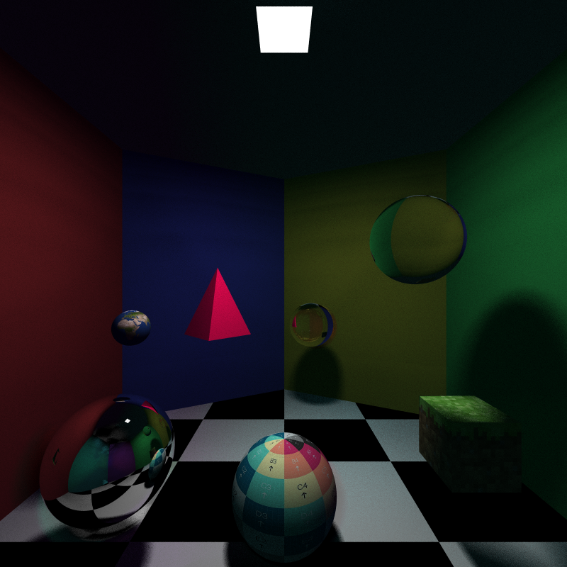

## TNCG15 Project - Raytracing from scratch in C++

A Monte Carlo Ray Tracer implemented from scratch in C++ in the course TNCG15 - Advanced Global Illumination and Rendering.

## Folder structure

- /include: Header files
- /src: Cpp files
- /images: Images from the ray tracer
- /textures: Texture files

## Setup instructions

Dependencies:

- [CMake](https://cmake.org/download/) for cross-platform compiler project generation.
- C++17 Required, e.g. [Visual Studio](https://visualstudio.microsoft.com/downloads/)

1. git clone https://github.com/casperlarsson-bit/Raytracing-TNCG15.git
2. Open CMake, enter the source path and the preferred build directory ("bin" folder) and hit configure.
3. Hit Generate and then Open Project to open the project in your IDE.
4. Update the CMakeLists.txt file when new .cpp or .h files are added.

Convert .PMM image to .PNG on [Convertio](https://convertio.co/)
